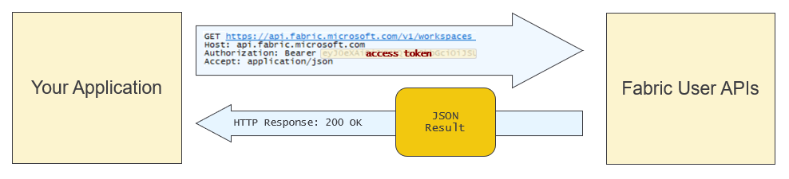
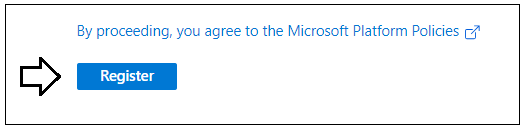

# Getting Started with the Fabric User API

The Fabric User API provides developers with the ability to automate
tasks in the Fabric environment such as creating and managing Fabric
workspaces and workspace items. The developer sample in this repository
named **FabricUserApiDemo** is a C# console application which
demonstrates creating Fabric workspaces and Fabric workspace items
included semantic models, reports, lakehouses and notebooks.

The design of the Fabric User API is based on REST principles,
established programming patterns and best practices for moving data
across the network as efficiently as possible. The Fabric User API is
secured using open security standards including Open ID Connect and
OAuth2. The Fabric User API use of REST and open security standards in
its design is what makes it accessible to any developer on any
development platform.

You can call the Fabric User API under the identity of a user or under
the identity of a service principal identity. Note that the initial
Public Preview release does not include full support for executing calls
as a service principal. Full support will for executing calls as a
service principal will come in early 2024. It is recommended that you
that you conduct your testing by executing Fabric User API calls as a
user through the end of 2023.

The Fabric User API is accessible in the public cloud through a base URL
for of **https://api.fabric.microsoft.com/v1**. Before calling and
endpoint of the Fabric User API, the caller must first acquire access
token from Azure AD. Once the access token has been acquired, the caller
must transmit it in all API calls using **Authorization** header.

In early 2024, Microsoft will release the Fabric User API .NET SDK. The
biggest benefit of the .NET SDK is that it abstracts away executing HTTP
request and converting JSON sent and received in API calls to and from
.NET objects. However, the Fabric User API .NET SDK is not available
with the initial Public Preview release. Therefore, there is code in the
**FabricUserApiDemo** project which executes HTTP request directly using
the .NET **HttpClient** class. The project also in includes custom
serialization classes which are used together with the .NET
**JsonSerializer** class to convert back and forth between JSON and .NET
objects.

## Setup

In case you have not heard, Microsoft recently renamed ***Azure Active
Directory*** to ***Microsoft Entra ID***. In the past, you would uses
the Azure AD portal to create an Azure application which can be used to
call Microsoft APIs such as the Microsoft Graph API and the Fabric User
API. Now, you will use the **Microsoft Entra admin center** to create a
new application for the C# console application named
**FabricUserApiDemo**. Start by navigating to **Microsoft Entra admin
center** at the following URL.

- [**https://entra.microsoft.com/**](https://entra.microsoft.com/)

On the home page of the **Microsoft Entra admin center**, drop down
the **Applications** section in the left navigation and click the **App
registrations** link.

On the **App registrations** page, click **New registration**.

Give the new application a name of **Fabric User API Demo** and leave
the Supported account types setting with the default selection
of **Accounts in this organizational directory only**.

Move down to the **Redirect URI** section. Select **Public
client/native** application in the drop down menu and enter a redirect
URI of [**http://localhost**](http://localhost/). Make sure to create
the URL with **http** and not **https**.

Click **Register** to create the new application.

Now that you have created the application, you need to record
Application ID for use later in the C# console application. Copy
the **Application ID** from the application summary page in the
Microsoft Entra admin center.

