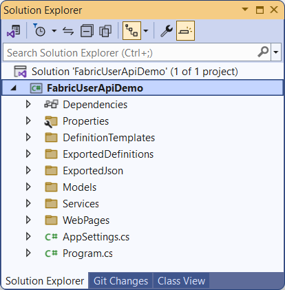

# Fabric User API Demo

The Fabric User API provides developers with the ability to automate
tasks in the Fabric environment such as creating and managing Fabric
workspaces and workspace items. This GitHub repository contains a
developer sample named **FabricUserApiDemo** which is a C# console
application demonstrating how to create Fabric workspaces and Fabric
workspace items included semantic models, reports, lakehouses and
notebooks.

> Have you heard the news? **Datasets** are no longer called **datasets**. They’ve been
renamed to **semantic models**.

## Next steps
 - Follow the instructions on the [Setup](https://github.com/PowerBiDevCamp/FabricUserApiDemo/blob/main/Setup.md) page to get this developer sample up and running
 - Read the [Microsoft Fabric REST API documentation](https://learn.microsoft.com/rest/api/fabric/articles/) to learn the fundementals
 - Read [Getting Started with the Fabric User
APIs](https://github.com/PowerBiDevCamp/FabricUserApiDemo/blob/main/Getting%20Started.md) to build your understanding of the code in this developer sample

---

> [!IMPORTANT]
> This project was updated Dec 6 with updates to deal with breaking changes applied to  the Fabric User API.
> Please download the latest version of this source code if you previously downloaded the source code for this project before this date.

 
