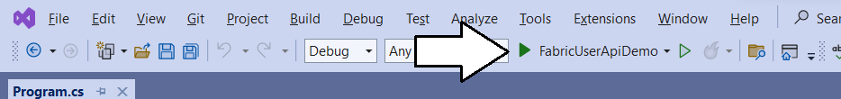

## Setting Up the FabricUserApiDemo Application

This document is provided to assist you with getting the
**FabricUserApiDemo** project up and running so you can begin your
testing with the Fabric User APIs. To set up this project for testing,
you will need a local installation of either Visual Studio 2022 or
Visual Studio Code.

This document will demonstrate setting up and running the application
using Visual Studio 2022 Community Edition which can be downloaded for
free from
[**here**](https://visualstudio.microsoft.com/thank-you-downloading-visual-studio/?sku=Community&channel=Release&version=VS2022&source=VSLandingPage&passive=false&cid=2030).

To set up the **FabricUserApiDemo** project for testing, you must
complete the following steps.

- Create a new Azure AD application to authenticate users and acquire
  access tokens

- Update the **AppSettings.cs** file with the **ApplicationId** of the
  new application

- Update the **AppSettings.cs** file with the Id of a capacity with
  enabled Fabric functionality.

In case you have not heard, Microsoft recently renamed ***Azure Active
Directory*** to ***Microsoft Entra ID***. In the past, you would
typically go to the Azure AD portal to create an new Azure AD
application which is used to call Microsoft secured APIs such as the
Microsoft Graph API and the Fabric User API. Now, it’s recommended to
use the **Microsoft Entra admin center** to create a new application for
the C# console application named **FabricUserApiDemo**.

Start by navigating to **Microsoft Entra admin center** at the following
URL.

- [**https://entra.microsoft.com/**](https://entra.microsoft.com/)

On the home page of the **Microsoft Entra admin center**, drop down
the **Applications** section in the left navigation and click the **App
registrations** link.

On the **App registrations** page, click **New registration**.

Give the new application a name of **Fabric User API Demo** and leave
the **Supported account types** setting with the default selection
of **Accounts in this organizational directory only**.

Move down to the **Redirect URI** section. Select **Public
client/native** application in the drop down menu and enter a redirect
URI of [**http://localhost**](http://localhost/).

The redirect URL of <http://localhost> was added for developers when
Microsoft introduced .NET Core. This simple redirect URL provides a safe
and easy way to authenticate .NET applications on your local desktop for
debugging and testing purposes. Resist the temptation to create the URL
with the **https** protocol instead of with **http** because it will not
work. The http protocol is the only one that will work.

Click **Register** to create the new application.

Now that you have created the application, you need to record
Application ID for use later in the C# console application. Copy
the **Application ID** from the application summary page.

## Run the FabricUserApiDemo Application in Visual Studio

Download all the files in the **FabricUserApiDemo** repository as a ZIP
archive using this [download
link](https://github.com/PowerBiDevCamp/FabricUserApiDemo/archive/refs/heads/main.zip).
Once you have downloaded the ZIP archive expand it’s contents into a
local folder named **FabricUserApiDemo** as shown in the following
screenshot. Once you have copied all the files from the ZIP archive into
the local folder, double click on FabricUserApi.sln to open the project
in Visual Studio 2022.

Once the **FabricUserApiDemo** project opens in Visual Studio, you
should be able to see the top-level files and folders in the Solution
Explorer as shown in the following screenshot. Next, open the source
file named **AppSettings.cs** so you can update configuration values
inside.

Xxxxx

Xx

Xxx

<https://app.powerbi.com/admin-portal/capacities/capacitiesList/>

ssss

ssss

Xxx

