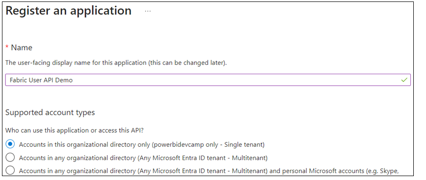

## Setting Up the FabricUserApiDemo Application
This document is provided to assist you with getting the
**FabricUserApiDemo** project up and running so you can begin your
testing with the Fabric User APIs. To set up this project for testing,
you will need a local installation of either Visual Studio 2022 or
Visual Studio Code.

> If you do not have Visual Studio, you can download the free version of Visual Studio 2022 Community Edition from
[**here**](https://visualstudio.microsoft.com/thank-you-downloading-visual-studio/?sku=Community&channel=Release&version=VS2022&source=VSLandingPage&passive=false&cid=2030).

To set up the **FabricUserApiDemo** project for testing, you must
complete the following steps.
- Create a new Azure AD application to authenticate users and acquire
  access tokens
- Update the **AppSettings.cs** file with the **ApplicationId** of the
  new application
- Update the **AppSettings.cs** file with the Id of a capacity with
  enabled Fabric functionality.

> In case you have not heard, Microsoft recently renamed ***Azure Active
Directory*** to ***Microsoft Entra ID***. In the past, you would
typically go to the Azure AD portal to create an new Azure AD
application which is used to call Microsoft secured APIs such as the
Microsoft Graph API and the Fabric User API. Now, it’s recommended to
use the **Microsoft Entra admin center** to create a new application for
the C# console application named **FabricUserApiDemo**.

Start by navigating to **Microsoft Entra admin center** at the following
URL.

- [**https://entra.microsoft.com/**](https://entra.microsoft.com/)

On the home page of the **Microsoft Entra admin center**, drop down
the **Applications** section in the left navigation and click the **App
registrations** link.

On the **App registrations** page, click **New registration**.

Give the new application a name of **Fabric User API Demo** and leave
the **Supported account types** setting with the default selection
of **Accounts in this organizational directory only**.

Move down to the **Redirect URI** section. Select **Public
client/native** application in the drop down menu and enter a redirect
URI of [**http://localhost**](http://localhost/).

The redirect URL of <http://localhost> was added for developers when
Microsoft introduced .NET Core. This simple redirect URL provides a safe
and easy way to authenticate .NET applications on your local desktop for
debugging and testing purposes. Resist the temptation to create the URL
with the **https** protocol instead of with **http** because it will not
work. The http protocol is the only one that will work.

Click **Register** to create the new application.

Now that you have created the application, you need to record
Application ID for use later in the C# console application. Copy
the **Application ID** from the application summary page.

## Run the FabricUserApiDemo Application in Visual Studio

First, you need to copy the source files for the **FabricUserApiDemo**
project to your local machine so you can open the project in Visual
Studio. If you have the GIT utility installed, you can clone the project
files to your machine using the following **git clone** command.

git clone https://github.com/PowerBiDevCamp/FabricUserApiDemo.git

If you do not use the git utility, you can download all the files in the
**FabricUserApiDemo** repository as a ZIP archive using this [**download
link**](https://github.com/PowerBiDevCamp/FabricUserApiDemo/archive/refs/heads/main.zip).
Once you have downloaded the ZIP archive, extract its contents into a
local folder named **FabricUserApiDemo**.

Once you have a copy of all the project files in a local folder, double
click on **FabricUserApi.sln** to open the project in Visual Studio
2022.

Once the **FabricUserApiDemo** project opens in Visual Studio, you
should be able to see the top-level files and folders in the Solution
Explorer as shown in the following screenshot. Your next step is to open
the source file named **AppSettings.cs** so you can update configuration
values inside.

The AppSettings.cs file contains several GUID-based Ids for
ApplicationId, a Fabric capacity ID and the Azure AD object Ids for two
users, a group and a service principal which are used to test workspace
role assignment.

Update the **const** named ApplicationId with the Application Id for the
Entra application you created in an earlier step.

Next, you need to determine the Id of a Fabric-enabled capacity in
Fabric environment you are using for your testing. You should be able to
see a list of available capacities in the Power BI Admin portal by
navigating to the following link.

<https://app.powerbi.com/admin-portal/capacities/capacitiesList/>

If you navigate to the page for a specific capacity in the Power BI
Admin portal, you should be able to retrieve the GUID-based capacity Id
from the address bar as shown in the following screenshot.

Once you have determined the Id of the Fabric-enabled capacity you will
use for testing, return to the project file named **AppSettings.cs** in
Visual Studio and update the const named **PremiumCapacityId**. Save
your changes to **AppSettings.cs**.

Now it is time to run the application. Begin by opening the
**Program.cs** file and verify matches the screenshot below. Running the
project for the first time will call the **CreateCustomerTenant** method
of the **CustomerTenantBuilder** class to create a new Fabric workspace.

Run the **FabricUserApiDemo** application in the Visual Studio debugger
by pressing {F5} or by clicking the Run button with the green arrow as
shown in the following screenshot.

When you run the application for the first time, the code which manages
user authentication will launch a browser window prompting you to sign
in. Sign in with the user account you will use for testing.

After signing in, you will be prompted with a very tall **Permissions
requested** dialog which lists the delegated user permissions (aka
permission scopes) the application has requested. Click the **Accept**
button at the bottom of the dialog to grant these permissions.

After clicking the Accept button, you will see a message in the browser
telling you the authentication process has completed. At this point, you
can close the browser window and navigate to the console window for the
running application.

When the program runs, it should be able to call into the Fabric User
API to create a new workspace. When the program completes, the console
for the application should display output as shown in the following
screenshot. If you press ENTER on the keyboard, the program will then
launch a browser and navigate to the new workspace that has just been
created.

You should be able to navigate to the new workspace and verify that it
has been created. The workspace should be empty.

While the workspace is empty, you should still be able to verify that it
has been assigned to a Fabric-enabled capacity.

Click the button with the 3 ellipses to the right of the **Manage
access** link to drop down the context menu for the workspace.

Select the **Workspace settings** command to display the **Workspace
settings** pane.

In the **Workspace settings** pane, verify that the new workspace is
associated with the capacity you configured in an earlier step.

This concludes the setup instructions for the FabricUserApiDemo project.
You can now experiment by uncommenting code in **Project.cs** to try
some of the other demonstrations which create semantic models, reports,
lakehouses and notebooks.
